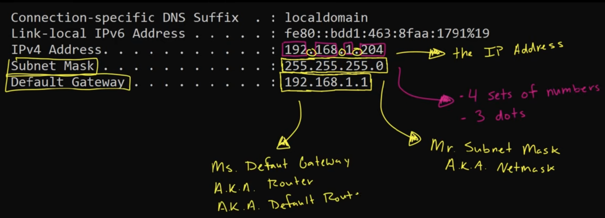
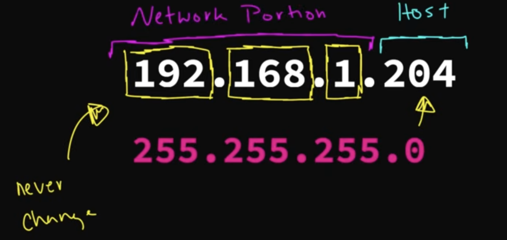

# Subnetting

## IP ADDRESS

### What is IP address?
- `IP (internet protocol)` is addresses of a device that can be use to used to communicate with each other and connect to the internet.
- It's a 4 sets of numbers (called **octets**) and separated by 3 dots.
- Each set can be a number **0 - 255**.


### How to find out your IP address?
On Windows cmd: `ipconfig`
On Mac/Linux: `ifconfig`

### How do your devices get their IP address?
- The router assigns your devices their IP address with the help of `subnet mask`.

### Basic Subnetting
- **Hack:** If you see `subnet 255`, it indicates that the corresponding `octet` of your IP address will stay the same within your network.
- The part of IP address that never change is called the `network portion` and the changing part is called `host portion`.
- Devices in a network is called `hosts`.


### Why is knowing the network portion and host portion of an IP address important?
- As an analogy, you can think the `network portion` is akin of a street adress (e.g. Private Drive) and the `host portion` is the `house number` within the same network.
- Devices within the same network can directly communicate with each other.
- In case they're not sharing the same network, they need to go through the  `default gateway / router` to communicate outside the network.

### How to determine the number of possible IP addresses that can be assigned in your network?
Assume we have this private IP address:
```
IP:			192	.	168	.	1	.	204
Subnet mask:	255	.	255	.	255	.	0
```
- There are always 3 IP addresses that you cannot use in any given network:
	1. The first IP address within your network (`network address`), which here is `192.168.1.0`.
	2. The last IP address within your network (`broadcast address`), which here is `192.168.1.255`.
	3. The `router/default gateway`, which here is `192.168.1.1`.

So in total, we can have `256 - 3 = 253` devices within this network.

###

## How IP Adresses Are Organized
In total, there are 4.3 Billion IP adresses (actually 2^32^) and they were put in **classes**. Problem?
1. There arelarge IP Adresses that can't be uses.
2. They gave away too many IP Addresses to big companies.

### 4. How the computer sees IP addresses

The computer sees the IP Addresses in binaries.
```
IP:			192	.		168	.		1.			204
Binary:		11000000	10101000	00000001	00010101

with 1->on and 0->off
```
Decimal to binary chart:
| 128  | 64   | 32   | 16   | 8    | 4    | 2    | 1    |
|------|------|------|------|------|------|------|------|
| 2^7^ | 2^6^ | 2^5^ | 2^4^ | 2^3^ | 2^2^ | 2^1^ | 2^0^ |

Conversion example:
```
1 1 0 0 0 0 0 0 -> 1*128 + 1*64 + 0*32 + ... + 0*1 = 192
```

To do Decimal to Binary conversion:
```
172 = 128*(1) - 64*(0) - 32*(1) - 16*(0) - 8*(1) - 4*(1) - 2*(0) - 1*(0)

128		64		32		16		8		4		2		1
  1		 0		 1		 0		1		1		0		0  <--- Binary
```

## 5. The Subnet Mask

We can also convert the subnet mask into binary:
```
Decimal:		255.			255.			255.			0
Binary:		11111111		11111111		11111111		00000000
			network		network		network		host
			\							/		 |
			 --------------------------------	 	 |
			 never change, tells us which			 |
			 network are on						 every bit here can be used to assign an ip address
```
- `1` = **network bits**
- `0` = **host bits**

So we know that the in this case the last octet `(00000101)` is the host bits. How many possible host in this network?
```
2 ^ (#of 0s) - 2 (reserved IP addresse )
= 2 ^ 8 of 0s  - 2 = 254 usable IP address
```
Which means, if we need more IP addresses within the network, we would need more `0`s in the bits, that can be taken from the network. This process is called **subnetting** (changin the subnet mask to suit our need).

For example, let's say we need 500 IP addresses instead of 254. We change the subnet to:
```
IP:			11000000.	10101000.	00100000.	00000101
Subnet:		11111111.	11111111.	11111110.	00000000
			255.			255.			254.			0
```


